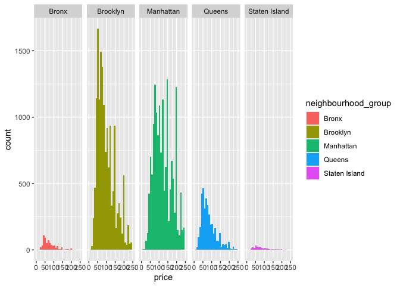
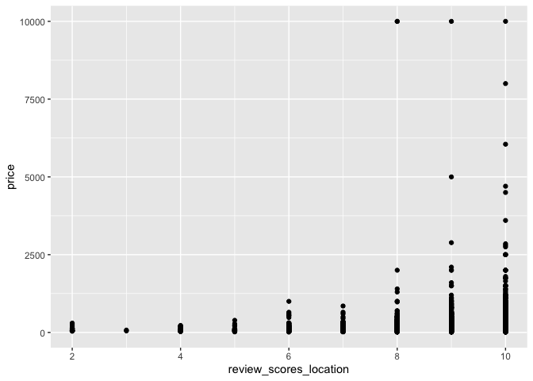
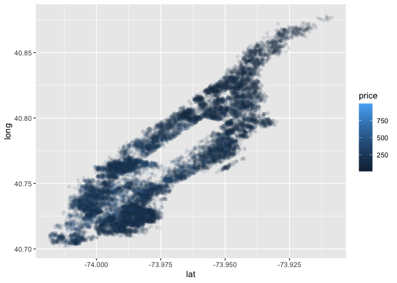
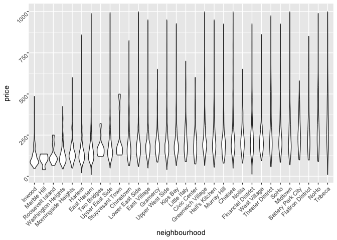

Case Study
================
2024-10-08

Load key packages and dataset.

``` r
library(tidyverse)
```

    ## ── Attaching core tidyverse packages ──────────────────────── tidyverse 2.0.0 ──
    ## ✔ dplyr     1.1.4     ✔ readr     2.1.5
    ## ✔ forcats   1.0.0     ✔ stringr   1.5.1
    ## ✔ ggplot2   3.5.1     ✔ tibble    3.2.1
    ## ✔ lubridate 1.9.3     ✔ tidyr     1.3.1
    ## ✔ purrr     1.0.2     
    ## ── Conflicts ────────────────────────────────────────── tidyverse_conflicts() ──
    ## ✖ dplyr::filter() masks stats::filter()
    ## ✖ dplyr::lag()    masks stats::lag()
    ## ℹ Use the conflicted package (<http://conflicted.r-lib.org/>) to force all conflicts to become errors

``` r
library(p8105.datasets)

data(nyc_airbnb)
```

## Brainstorm questions

- Where are max and min airbnb prices?
  - What are average prices?
  - What factors affect prices?
- Where are prices going up and down over time?
- What’s the relationship between number of reviews and average prices?
- Does room type affect availability?
- What’s the location of the unit?
  - What areas are popular?
  - Popularity = number of units? Average price?
- Are there repeat hosts?
  - If so, what does that mean?
- How does price of unit change based on distance to Times Square?
- What is the relationship between minimum number of nights and reviews?
- What is the relationship between reviews and neighborhood?

``` r
nyc_airbnb |>
  summarize (max_price = max (price))
```

    ## # A tibble: 1 × 1
    ##   max_price
    ##       <dbl>
    ## 1     10000

``` r
nyc_airbnb |>
  summarize (min_price = min (price))
```

    ## # A tibble: 1 × 1
    ##   min_price
    ##       <dbl>
    ## 1        10

``` r
nyc_airbnb |>
  summarize (ave_price = mean (price))
```

    ## # A tibble: 1 × 1
    ##   ave_price
    ##       <dbl>
    ## 1      145.

``` r
nyc_airbnb %>%
  ggplot(aes(x = price, fill = neighbourhood_group)) +
  geom_histogram() +
  facet_grid(. ~ neighbourhood_group) +
  scale_x_continuous(limits = c(0, 250))
```

    ## `stat_bin()` using `bins = 30`. Pick better value with `binwidth`.

    ## Warning: Removed 3810 rows containing non-finite outside the scale range
    ## (`stat_bin()`).

    ## Warning: Removed 10 rows containing missing values or values outside the scale range
    ## (`geom_bar()`).

<!-- -->

``` r
nyc_airbnb %>%
  filter(calculated_host_listings_count > 34)
```

    ## # A tibble: 35 × 17
    ##          id review_scores_location name    host_id host_name neighbourhood_group
    ##       <dbl>                  <dbl> <chr>     <dbl> <chr>     <chr>              
    ##  1 15057686                     NA Home 4…  2.64e7 Stat      Brooklyn           
    ##  2 15080936                     NA Home 4…  2.64e7 Stat      Brooklyn           
    ##  3 14776203                     10 Home 4…  2.64e7 Stat      Brooklyn           
    ##  4 15074005                     NA Home 4…  2.64e7 Stat      Brooklyn           
    ##  5  5866656                     NA Home 4…  2.64e7 Stat      Brooklyn           
    ##  6  5538353                     NA Home 4…  2.64e7 Stat      Brooklyn           
    ##  7  5632551                     10 Home 4…  2.64e7 Stat      Brooklyn           
    ##  8  7788565                     NA Home 4…  2.64e7 Stat      Brooklyn           
    ##  9  7789408                      9 Home4 …  2.64e7 Stat      Brooklyn           
    ## 10  7789213                     10 Home 4…  2.64e7 Stat      Brooklyn           
    ## # ℹ 25 more rows
    ## # ℹ 11 more variables: neighbourhood <chr>, lat <dbl>, long <dbl>,
    ## #   room_type <chr>, price <dbl>, minimum_nights <dbl>,
    ## #   number_of_reviews <dbl>, last_review <date>, reviews_per_month <dbl>,
    ## #   calculated_host_listings_count <dbl>, availability_365 <dbl>

``` r
nyc_airbnb %>%
  group_by(neighbourhood_group) %>%
  summarise(total_reviews = sum(number_of_reviews, na.rm = TRUE)) %>%
  arrange(desc(total_reviews))
```

    ## # A tibble: 5 × 2
    ##   neighbourhood_group total_reviews
    ##   <chr>                       <dbl>
    ## 1 Manhattan                  323941
    ## 2 Brooklyn                   263542
    ## 3 Queens                      66611
    ## 4 Bronx                        9897
    ## 5 Staten Island                4744

``` r
nyc_airbnb |> 
  ggplot(aes(x = review_scores_location, y = price)) + 
  geom_point()
```

    ## Warning: Removed 10037 rows containing missing values or values outside the scale range
    ## (`geom_point()`).

<!-- -->

``` r
nyc_airbnb |> 
  filter(neighbourhood_group == "Manhattan", 
         price < 1000) |> 
  ggplot(aes(x = lat, y = long, color = price)) + 
  geom_point(alpha = .1)
```

<!-- -->

``` r
nyc_airbnb |> 
  filter(neighbourhood_group == "Manhattan", 
         price < 1000, 
         room_type == "Entire home/apt") |>
  group_by(neighbourhood) |> 
  summarize(mean_price = mean(price)) |> 
  arrange(desc(mean_price))
```

    ## # A tibble: 32 × 2
    ##    neighbourhood      mean_price
    ##    <chr>                   <dbl>
    ##  1 Tribeca                  358.
    ##  2 NoHo                     312.
    ##  3 Flatiron District        307.
    ##  4 SoHo                     296.
    ##  5 Theater District         282.
    ##  6 Midtown                  276.
    ##  7 Battery Park City        271.
    ##  8 Greenwich Village        256.
    ##  9 Chelsea                  255.
    ## 10 Financial District       250.
    ## # ℹ 22 more rows

``` r
nyc_airbnb |> 
  filter(neighbourhood_group == "Manhattan", 
         price < 1000, 
         room_type == "Entire home/apt") |>
  mutate(neighbourhood = fct_reorder(neighbourhood, price)) |> 
  ggplot(aes(x = neighbourhood, y = price)) + 
  geom_violin() +
  theme(axis.text = element_text(angle = 45, vjust = 1, hjust=1))
```

<!-- -->
